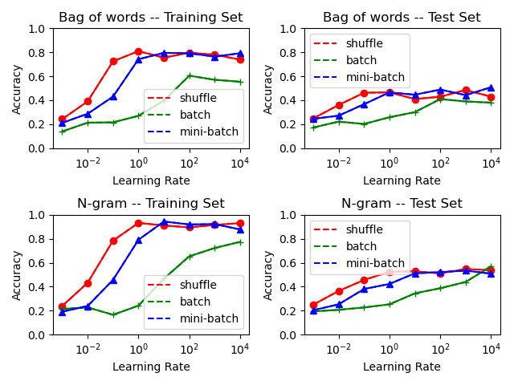
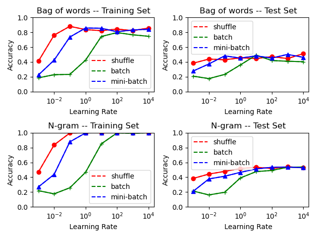

# 实验设置
* 特征表示
    * Bag-of-Word
    * N-gram(N=2) 
* 模型
    * softmax regression
* 损失函数
    * 交叉熵损失 
* 学习率
    * 0.001, 0.01, 0.1, 1, 10, 100, 1000, 10000
* 梯度下降样本选取策略
    * shuffle
    * batch
    * mini-batch(batch_size=10)
* 训练步数
    * 10000, 100000
# 实验结果
## 训练10000步

## 训练100000步

# 结果分析
1. 特征表示。N-gram特征的整体分类准确率要比词袋模型要好，因为词袋模型忽略了位置信息，上下文语义的表示效果较差。
2. 学习率。可以看到在其他超参数不变的情况下，当学习率从0.001逐渐增加到100时，训练集和测试集上的效果是在提升的，继续提升学习率模型的效果变化较小，区域平缓。小的学习率容易达到局部最优，增大学习率有利于获得全局最优效果，但是当学习率增加到一定程度时可能会造成训练不收敛。
3. 梯度下降样本选取策略。在学习率较小的时候，随机梯度下降的效果比另外两种都好，在学习率较大的时候，小批次梯度下降和随机梯度下降的效果基本相当，二者都比全批次梯度下降的效果好。较小的bsz每个批次的梯度估计更准确，大批次可能会导致模型陷入较差的局部极小值，因为梯度估计可能会不够准确。比如shuffle的bsz设置为1，它整体的效果要比另外两种好。
4. 训练步数。100000步的训练集上的效果相比10000步的训练集效果提升很多，但是测试集上的效果没有明显提升，而且测试集整体的效果与训练集上的效果相差很多，这说明发生了过拟合。可能的原因有训练步数过大、数据量不够等。