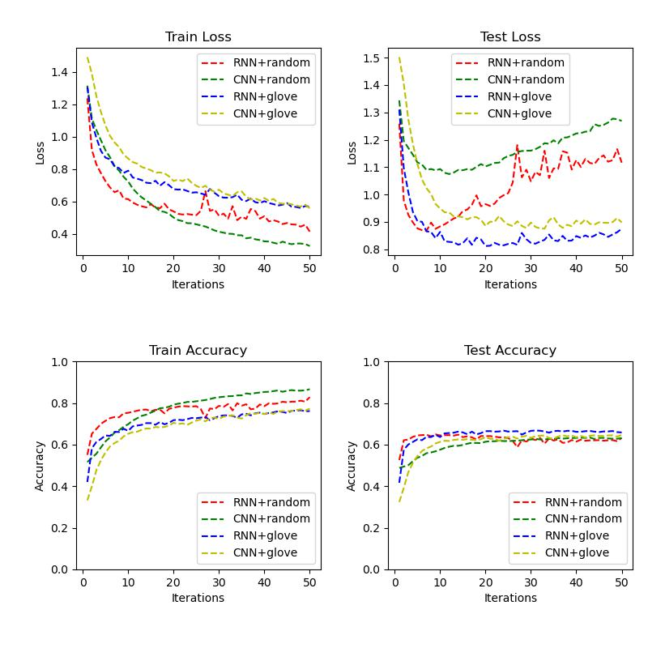
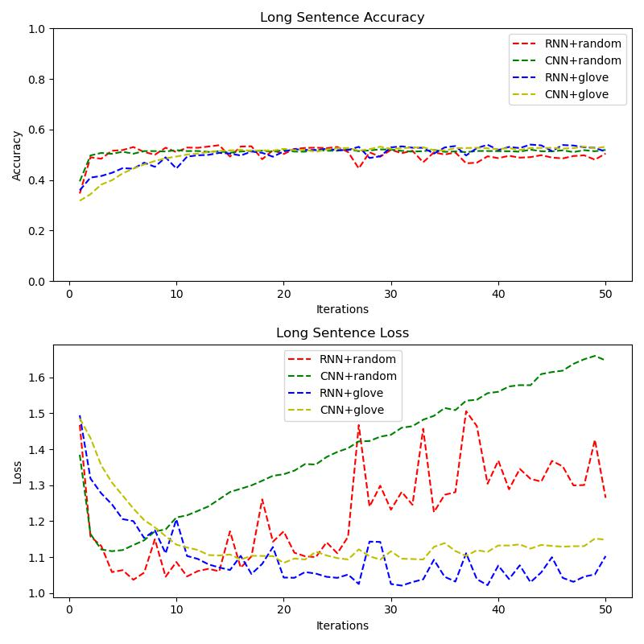

# 实验设置
* 特征表示
    * random embedding
    * glove embedding
* 模型
    * cnn
    * rnn
* 损失函数
    * 交叉熵损失 
* 学习率
    * 0.001
* batch_size
    * 500
* 迭代轮数
    * 50
# 实验结果
## 短句子

## 长句子测试集

# 结果分析
1. 模型。RNN在测试集的准确率（最大值）比CNN都要高，且测试集的损失值（最小值）也要比CNN的要低。
2. embedding初始化。在同种模型下，GloVe初始化也要比随机初始化的效果好，即在测试集准确率大、测试集损失值小。
3. 最终，短句子的测试集准确率大约在66%左右。
4. 对于长句子（单词数大于20），RNN的效果并不比CNN好，而且无论是CNN还是RNN，长句子的情感分类准确率也只有大概55%左右，比总体的平均正确率低了约10%。