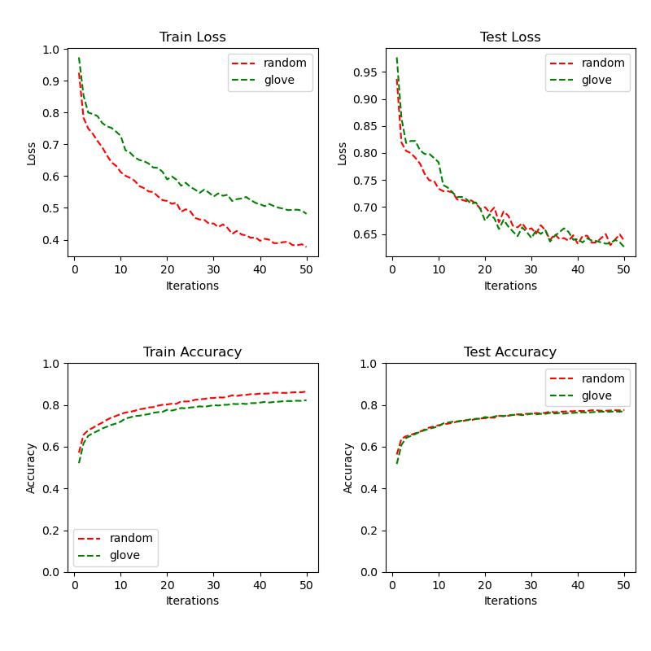

# 实验设置
* 数据
    * 排序（按长度）
    * 未排序
* 特征表示
    * random embedding
    * glove embedding
* 模型
    * ESIM
* 损失函数
    * 交叉熵损失 
* 网络参数
    * len_feature = 50
    * len_hidden = 50
    * hidden_layer=1
* 训练参数
    * learning_rate = 0.001
    * iter_times: 50
    * batch_size: 1000
    * drop_out: 0.5
# 实验结果
## 数据经排序的结果

## 数据未经排序的结果

# 结果分析
1. 对输入文本（前提）按长度排序后的准确率与未排序的准确率相差不大，都是接近80%。可能假设句子的长度也有影响。
2. 在该任务中，随即初始化的嵌入和glove初始化的嵌入最终的测试效果几乎没有区别。本次设置的词向量维度与隐含层维度都是50，可能由于维度设置的偏小，导致一些语义无法体现，进而无法体现出glove初始化的优势。