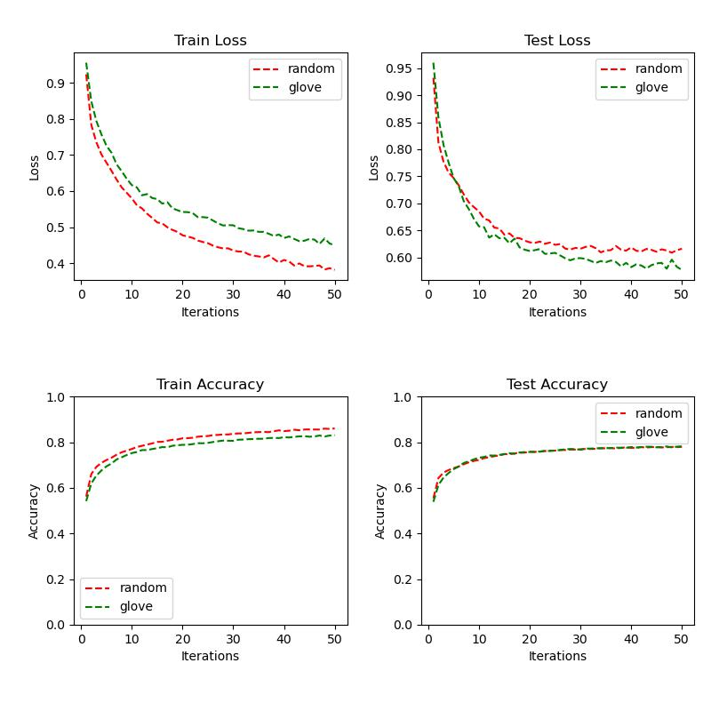

# 实验设置
* 数据
    * 排序（按长度）
    * 未排序
* 特征表示
    * random embedding
    * glove embedding
* 模型
    * ESIM
* 损失函数
    * 交叉熵损失 
* 网络参数
    * len_feature = 50
    * len_hidden = 50
    * hidden_layer=1
* 训练参数
    * learning_rate = 0.001
    * iter_times: 50
    * batch_size: 1000
    * drop_out: 0.5
# 实验结果
## 数据经排序的结果

## 数据未经排序的结果

# 结果分析