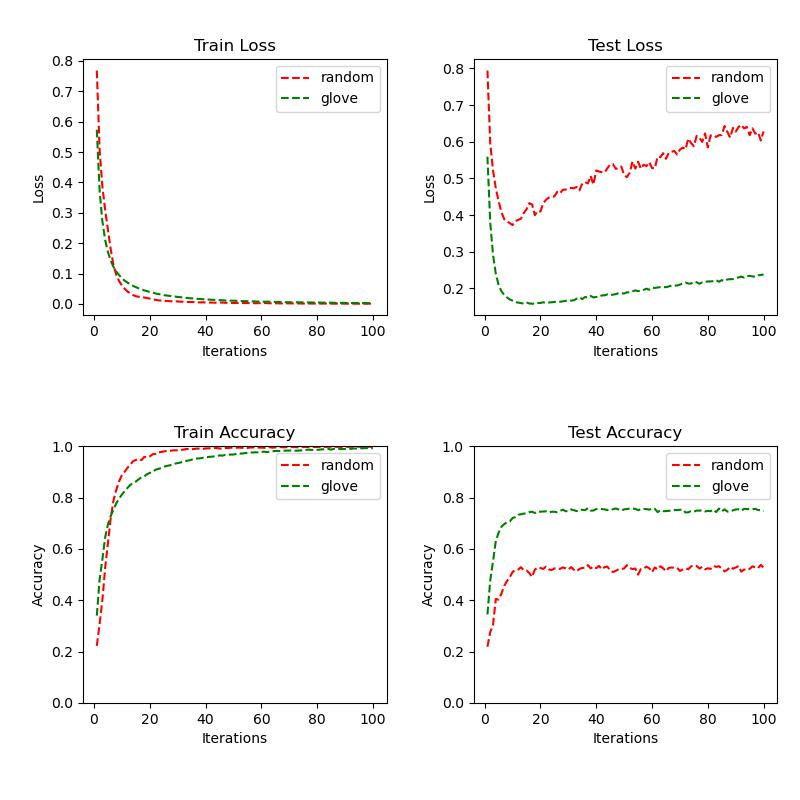

# 实验设置
* 特征表示
    * random embedding
    * glove embedding
* 模型
    * Bi-LSTM + CRF 
* 损失
    * loss: -(True_score(X,y)−log(Total_score))
* 网络参数
    * len_feature = 50
    * len_hidden = 50
    * hidden_layer=1
* 训练参数
    * learning_rate = 0.001
    * iter_times: 100
    * batch_size: 100
    * drop_out: 0.5
# 实验结果
## 训练和测试

# 结果分析
1. 在测试集上，glove初始化的效果比随机初始化的效果明显好，前者的准确率能到76%，后者的准确率最高只有55%。
2. 训练集上的损失在第10轮之前减速很快，之后慢慢减小至平稳，直至收敛。测试集上的损失在第10轮之前减速很快，之后慢慢增加，准确率不再有明显变化。说明在第10轮之后模型对训练数据过拟合。