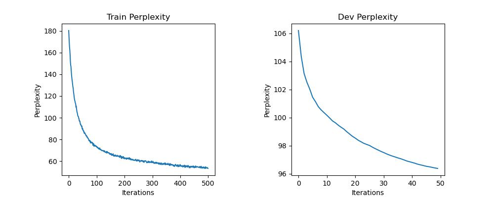

# 实验设置
* 特征表示
    * random embedding
* 模型
    * LSTM
    * GRU 
* 损失函数
    * 交叉熵损失
* 网络参数
    * len_feature = 50
    * len_hidden = 50
    * hidden_layer=1
* 训练参数
    * learning_rate = 0.004
    * iter_times: 10
    * batch_size: 1
    * drop_out: 0.5
# 实验结果
## 困惑度

# 结果分析