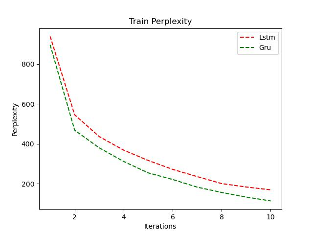

# 实验设置
* 特征表示
    * random embedding
* 模型
    * LSTM
    * GRU 
* 损失函数
    * 交叉熵损失
* 网络参数
    * len_feature = 50
    * len_hidden = 50
    * hidden_layer=1
* 训练参数
    * learning_rate = 0.004
    * iter_times: 10
    * batch_size: 1
    * drop_out: 0.5
# 实验结果
## 困惑度

# 结果分析
1. 随着迭代次数的增加，模型输入训练集数据生成的诗歌的困惑度逐渐下降，在第10轮的时候梯度仍有明显变化，说明训练轮数还可以再增大以提升模型生成效果。
2. Gru的整体效果比Lstm好。可能是由于GRU具有较少的门控单元，所以它通常比LSTM更容易训练，因为每个时间步的计算成本更低。这可以导致更快的训练速度，以便模型更快地收敛到较低的困惑度。